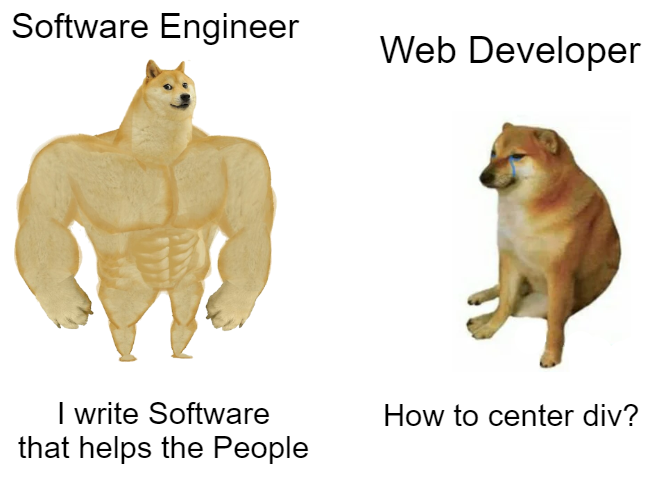
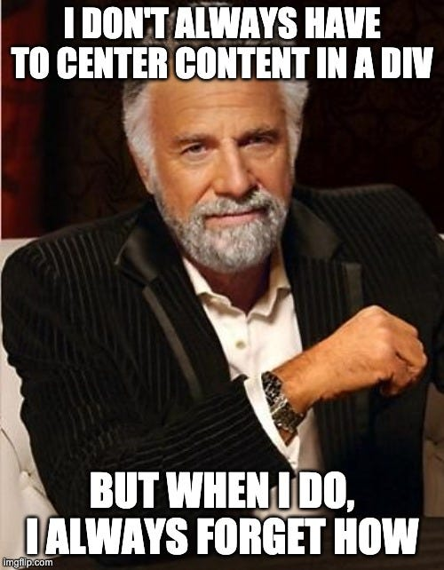
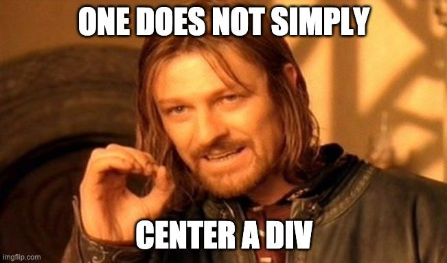
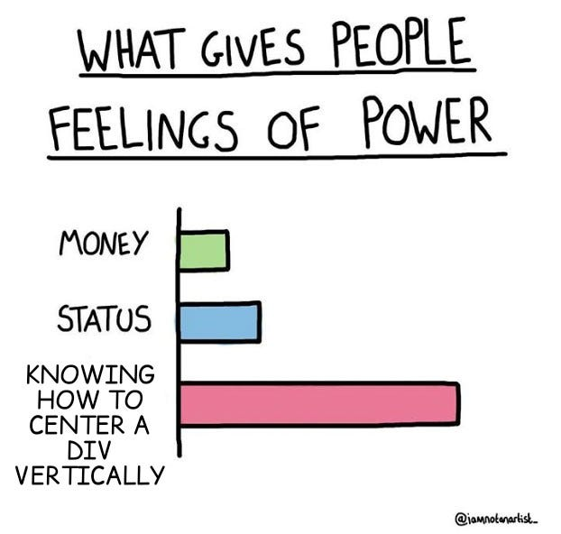
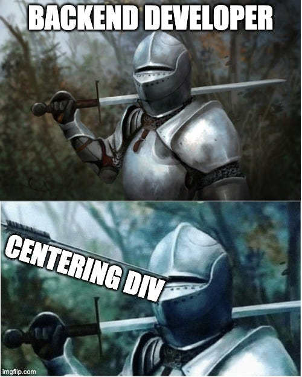
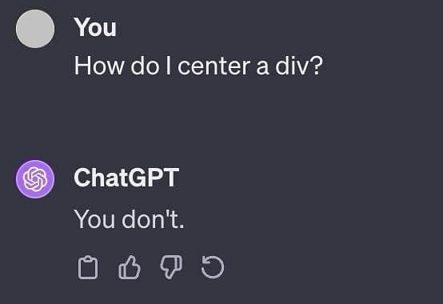

# Sesión 05 - Formularios HTML

<!-- **Fecha:** 17 de Febrero de 2026 -->

## Contenidos de la Sesión

### 1. Introducción a Formularios HTML

Los **formularios HTML** son elementos fundamentales para la interacción del usuario con las páginas web. Permiten recopilar información del usuario y enviarla a un servidor para su procesamiento.

**¿Por qué usar formularios?**

- **Interacción con el usuario**: Permiten la comunicación bidireccional
- **Recopilación de datos**: Capturan información como contacto, preferencias, búsquedas
- **Autenticación**: Login y registro de usuarios
- **Comercio electrónico**: Procesos de compra y checkout
- **Feedback**: Comentarios, encuestas, contacto

**Ejemplos comunes de formularios:**

- Formularios de contacto
- Formularios de registro/login
- Búsquedas
- Encuestas y cuestionarios
- Formularios de pago
- Comentarios en blogs

### 2. Elemento `<form>`

El elemento `<form>` es el contenedor principal que agrupa todos los campos de entrada y controles del formulario.

**Sintaxis básica:**

```html
<form action="url-destino" method="POST">
  <!-- Campos del formulario -->
</form>
```

**Atributos principales:**

#### `action`

Define la URL donde se enviarán los datos del formulario al ser enviado.

```html
<form action="/procesar-contacto" method="POST">
  <!-- campos -->
</form>
```

#### `method`

Especifica el método HTTP para enviar los datos del formulario.

- **`GET`**: Los datos se envían en la URL (visibles). Usado para búsquedas.
- **`POST`**: Los datos se envían en el cuerpo de la petición (no visibles). Usado para enviar información sensible.

```html
<!-- Formulario de búsqueda -->
<form action="/buscar" method="GET">
  <input type="text" name="q" />
  <button type="submit">Buscar</button>
</form>

<!-- Formulario de contacto -->
<form action="/contacto" method="POST">
  <input type="email" name="email" />
  <button type="submit">Enviar</button>
</form>
```

**Ejemplo completo:**

```html
<form action="/procesar-formulario" method="POST">
  <label for="nombre">Nombre:</label>
  <input type="text" id="nombre" name="nombre" />

  <label for="email">Email:</label>
  <input type="email" id="email" name="email" />

  <button type="submit">Enviar</button>
</form>
```

### 3. Elemento `<input>`

El elemento `<input>` es el campo de entrada más versátil y común en formularios. Su comportamiento cambia según el atributo `type`.

**Sintaxis básica:**

```html
<input type="tipo" name="nombre" id="identificador" />
```

**Atributos comunes a todos los inputs:**

- **`type`**: Define el tipo de campo (text, email, password, etc.)
- **`name`**: Nombre del campo que se enviará al servidor (**muy importante**)
- **`id`**: Identificador único para vincular con `<label>`
- **`value`**: Valor por defecto del campo
- **`placeholder`**: Texto de ayuda que aparece cuando el campo está vacío
- **`required`**: Hace que el campo sea obligatorio
- **`disabled`**: Desactiva el campo
- **`readonly`**: Campo de solo lectura

#### Atributo `name` - ¡IMPORTANTE!

El atributo `name` es **fundamental** en los formularios:

- **Al enviar el formulario**: Solo los campos con `name` se envían al servidor
- **Identificación de datos**: El servidor recibe los datos con el nombre especificado
- **En radio buttons**: Agrupa las opciones para que solo se pueda seleccionar una

```html
<!-- Sin name: NO se enviará -->
<input type="text" id="usuario" />

<!-- Con name: SÍ se enviará como "usuario=valor" -->
<input type="text" id="usuario" name="usuario" />
```

**Ejemplo de datos enviados:**

```html
<form action="/registro" method="POST">
  <input type="text" name="nombre" value="Juan" />
  <input type="email" name="email" value="juan@example.com" />
  <button type="submit">Enviar</button>
</form>
```

Datos enviados al servidor:

```
nombre=Juan
email=juan@example.com
```

### 4. Tipos de Input

#### `type="text"`

Campo de texto de una sola línea. Es el tipo por defecto.

**Características:**

- Para textos cortos (nombre, apellido, ciudad)
- Una sola línea
- Texto visible

```html
<label for="nombre">Nombre:</label>
<input
  type="text"
  id="nombre"
  name="nombre"
  placeholder="Introduce tu nombre"
  required
/>
```

**Atributos específicos:**

- `maxlength`: Longitud máxima de caracteres
- `minlength`: Longitud mínima de caracteres
- `pattern`: Patrón de validación con expresiones regulares

```html
<input
  type="text"
  name="codigo-postal"
  pattern="[0-9]{5}"
  maxlength="5"
  placeholder="28001"
/>
```

#### `type="password"`

Campo de contraseña. El texto introducido se muestra oculto con asteriscos o puntos.

**Características:**

- El texto se muestra oculto por seguridad
- El valor NO se muestra en la URL (incluso con GET)
- Importante usar siempre con `method="POST"`

```html
<label for="password">Contraseña:</label>
<input type="password" id="password" name="password" required minlength="8" />
```

**Ejemplo de formulario de login:**

```html
<form action="/login" method="POST">
  <label for="email">Email:</label>
  <input type="email" id="email" name="email" required />

  <label for="pass">Contraseña:</label>
  <input type="password" id="pass" name="password" required minlength="8" />

  <button type="submit">Iniciar Sesión</button>
</form>
```

#### `type="email"`

Campo especializado para direcciones de correo electrónico.

**Características:**

- Validación automática del formato de email
- En móviles, muestra teclado optimizado para emails
- Incluye validación básica (debe contener @)

```html
<label for="email">Correo Electrónico:</label>
<input
  type="email"
  id="email"
  name="email"
  placeholder="tu@email.com"
  required
/>
```

**Atributos específicos:**

- `multiple`: Permite ingresar múltiples emails separados por comas

```html
<input
  type="email"
  name="emails"
  multiple
  placeholder="email1@example.com, email2@example.com"
/>
```

#### `type="date"`

Campo para seleccionar fechas.

**Características:**

- Muestra un selector de calendario (depende del navegador)
- Formato estándar: YYYY-MM-DD
- Validación automática de fechas

```html
<label for="fecha-nacimiento">Fecha de Nacimiento:</label>
<input
  type="date"
  id="fecha-nacimiento"
  name="fecha-nacimiento"
  min="1900-01-01"
  max="2026-12-31"
/>
```

**Atributos específicos:**

- `min`: Fecha mínima permitida
- `max`: Fecha máxima permitida
- `value`: Fecha por defecto (formato YYYY-MM-DD)

```html
<label for="fecha-evento">Fecha del Evento:</label>
<input type="date" name="fecha-evento" min="2026-02-17" value="2026-03-01" />
```

#### `type="color"`

Campo para seleccionar un color.

**Características:**

- Muestra un selector de color (color picker)
- Valor en formato hexadecimal (#RRGGBB)
- Ideal para personalización de temas

```html
<label for="color-favorito">Color Favorito:</label>
<input type="color" id="color-favorito" name="color-favorito" value="#ff0000" />
```

**Ejemplo práctico:**

```html
<form>
  <label for="color-fondo">Color de Fondo:</label>
  <input type="color" id="color-fondo" name="color-fondo" value="#ffffff" />

  <label for="color-texto">Color de Texto:</label>
  <input type="color" id="color-texto" name="color-texto" value="#000000" />
</form>
```

#### `type="radio"`

Botones de opción múltiple donde **solo se puede seleccionar una opción**.

**Características:**

- Permite seleccionar solo UNA opción de un grupo
- Se agrupan mediante el atributo `name` (**IMPORTANTE**)
- Todos los radio buttons del mismo grupo deben tener el mismo `name`
- Cada opción tiene un `value` diferente

```html
<p>Selecciona tu género:</p>

<input type="radio" id="masculino" name="genero" value="masculino" />
<label for="masculino">Masculino</label>

<input type="radio" id="femenino" name="genero" value="femenino" />
<label for="femenino">Femenino</label>

<input type="radio" id="otro" name="genero" value="otro" />
<label for="otro">Otro</label>
```

**¿Por qué el mismo `name`?**

El atributo `name` agrupa los radio buttons. Cuando varios radio buttons comparten el mismo `name`:

- Solo se puede seleccionar uno del grupo
- Al seleccionar uno, se deseleccionan automáticamente los demás
- Se envía solo el `value` del radio button seleccionado

**Ejemplo incorrecto (cada uno es independiente):**

```html
<!-- ❌ INCORRECTO: nombres diferentes, se pueden marcar todos -->
<input type="radio" name="opcion1" value="si" /> Sí
<input type="radio" name="opcion2" value="no" /> No
```

**Ejemplo correcto (opciones mutuamente excluyentes):**

```html
<!-- ✅ CORRECTO: mismo nombre, solo uno seleccionable -->
<input type="radio" name="respuesta" value="si" /> Sí
<input type="radio" name="respuesta" value="no" /> No
```

**Atributo `checked`:**

Marca una opción como seleccionada por defecto.

```html
<input type="radio" name="newsletter" value="si" checked /> Sí
<input type="radio" name="newsletter" value="no" /> No
```

**Ejemplo completo de encuesta:**

```html
<form>
  <fieldset>
    <legend>¿Cuál es tu nivel de experiencia con HTML?</legend>

    <input
      type="radio"
      id="principiante"
      name="nivel"
      value="principiante"
      checked
    />
    <label for="principiante">Principiante</label><br />

    <input type="radio" id="intermedio" name="nivel" value="intermedio" />
    <label for="intermedio">Intermedio</label><br />

    <input type="radio" id="avanzado" name="nivel" value="avanzado" />
    <label for="avanzado">Avanzado</label>
  </fieldset>
</form>
```

#### `type="checkbox"`

Casillas de verificación que permiten seleccionar **múltiples opciones**.

**Características:**

- Permite seleccionar CERO, UNA o VARIAS opciones
- Cada checkbox es independiente
- Puede tener diferentes `name` o el mismo (para agrupar lógicamente)
- Se envía solo si está marcado (checked)

```html
<p>Selecciona tus lenguajes de programación favoritos:</p>

<input type="checkbox" id="html" name="html" value="html" />
<label for="html">HTML</label>

<input type="checkbox" id="css" name="css" value="css" />
<label for="css">CSS</label>

<input type="checkbox" id="javascript" name="javascript" value="javascript" />
<label for="javascript">JavaScript</label>
```

**Atributo `checked`:**

Marca un checkbox como seleccionado por defecto.

```html
<input type="checkbox" name="newsletter" value="si" checked />
<label>Suscribirme al newsletter</label>
```

**Diferencia con radio buttons:**

| Característica | Radio (`type="radio"`)                    | Checkbox (`type="checkbox"`)         |
| -------------- | ----------------------------------------- | ------------------------------------ |
| Selecciones    | Solo UNA opción                           | MÚLTIPLES opciones                   |
| Agrupación     | Mismo `name` obligatorio                  | `name` independiente o igual         |
| Deselección    | No se puede deseleccionar una vez marcado | Se puede marcar/desmarcar libremente |
| Uso            | Opciones excluyentes                      | Opciones independientes              |

**Ejemplo práctico:**

```html
<form>
  <fieldset>
    <legend>¿Qué tecnologías conoces?</legend>

    <input
      type="checkbox"
      id="tech-html"
      name="tecnologias[]"
      value="html"
      checked
    />
    <label for="tech-html">HTML</label><br />

    <input
      type="checkbox"
      id="tech-css"
      name="tecnologias[]"
      value="css"
      checked
    />
    <label for="tech-css">CSS</label><br />

    <input
      type="checkbox"
      id="tech-js"
      name="tecnologias[]"
      value="javascript"
    />
    <label for="tech-js">JavaScript</label><br />

    <input type="checkbox" id="tech-react" name="tecnologias[]" value="react" />
    <label for="tech-react">React</label>
  </fieldset>
</form>
```

**Datos enviados (si se marcan HTML y CSS):**

```
tecnologias[]=html
tecnologias[]=css
```

### 5. Elemento `<label>`

El elemento `<label>` proporciona una etiqueta descriptiva para los campos del formulario.

**¿Por qué usar `<label>`?**

- **Accesibilidad**: Los lectores de pantalla pueden asociar la etiqueta con el campo
- **Usabilidad**: Al hacer clic en el label, se activa el campo asociado
- **Semántica**: Define claramente qué es cada campo
- **UX mejorada**: Área de clic más grande (especialmente útil en checkboxes y radios)

**Sintaxis:**

Hay dos formas de asociar un `<label>` con un campo:

#### Método 1: Usando el atributo `for` (recomendado)

```html
<label for="nombre">Nombre:</label>
<input type="text" id="nombre" name="nombre" />
```

El atributo `for` del `<label>` debe coincidir con el `id` del `<input>`.

#### Método 2: Anidando el input dentro del label

```html
<label>
  Nombre:
  <input type="text" name="nombre" />
</label>
```

> [!TIP]
> **Se recomienda usar el método 1 (atributo `for`)** porque:
>
> - Es más flexible para posicionar elementos
> - Es más claro y explícito
> - Facilita el uso de CSS Grid/Flexbox
> - Es la convención más común

**Ejemplos prácticos:**

```html
<!-- Con campos de texto -->
<label for="email">Correo Electrónico:</label>
<input type="email" id="email" name="email" />

<!-- Con checkboxes (mejor experiencia de usuario) -->
<input type="checkbox" id="acepto" name="acepto" />
<label for="acepto">Acepto los términos y condiciones</label>

<!-- Con radio buttons -->
<input type="radio" id="opcion-si" name="respuesta" value="si" />
<label for="opcion-si">Sí</label>

<input type="radio" id="opcion-no" name="respuesta" value="no" />
<label for="opcion-no">No</label>
```

**Ventaja de hacer clic en el label:**

```html
<!-- ✅ Con label: puedes hacer clic en el texto para marcar el checkbox -->
<input type="checkbox" id="suscripcion" name="suscripcion" />
<label for="suscripcion">Quiero recibir el newsletter</label>

<!-- ❌ Sin label: solo puedes hacer clic en el pequeño checkbox -->
<input type="checkbox" name="suscripcion" />
Quiero recibir el newsletter
```

**Ejemplo completo de formulario con labels:**

```html
<form>
  <div>
    <label for="nombre-completo">Nombre Completo:</label>
    <input type="text" id="nombre-completo" name="nombre-completo" required />
  </div>

  <div>
    <label for="correo">Email:</label>
    <input type="email" id="correo" name="correo" required />
  </div>

  <div>
    <label for="mensaje-texto">Mensaje:</label>
    <textarea id="mensaje-texto" name="mensaje" rows="5"></textarea>
  </div>

  <div>
    <input type="checkbox" id="terminos" name="terminos" required />
    <label for="terminos">Acepto los términos y condiciones</label>
  </div>

  <button type="submit">Enviar</button>
</form>
```

### 6. Elemento `<button>`

El elemento `<button>` crea un botón interactivo en el formulario.

**Sintaxis:**

```html
<button type="tipo">Texto del botón</button>
```

**Atributo `type`:**

El atributo `type` define el comportamiento del botón:

#### `type="submit"` (Por defecto)

Envía el formulario al servidor.

```html
<button type="submit">Enviar Formulario</button>
```

Este es el comportamiento **por defecto**. Si no especificas `type`, el botón funcionará como `submit`.

```html
<!-- Estos dos botones son equivalentes -->
<button type="submit">Enviar</button>
<button>Enviar</button>
```

#### `type="reset"`

Restablece todos los campos del formulario a sus valores iniciales.

```html
<button type="reset">Limpiar Formulario</button>
```

#### `type="button"`

Botón sin comportamiento por defecto. Se usa con JavaScript para acciones personalizadas.

```html
<button type="button" onclick="alert('Hola!')">Haz clic</button>
```

**Diferencia entre `<button>` y `<input type="submit">`:**

```html
<!-- Opción 1: Con <button> (recomendado) -->
<button type="submit">Enviar</button>

<!-- Opción 2: Con <input> (anticuado) -->
<input type="submit" value="Enviar" />
```

**Ventajas de `<button>`:**

- ✅ Puede contener HTML (imágenes, iconos, texto formateado)
- ✅ Más flexible para estilizar con CSS
- ✅ Más semántico y moderno
- ✅ Permite contenido enriquecido

```html
<!-- <button> puede contener HTML -->
<button type="submit"> Enviar Mensaje</button>

<!-- <input> solo puede tener texto plano -->
<input type="submit" value="Enviar Mensaje" />
```

**Ejemplo completo de formulario con botones:**

```html
<form action="/procesar" method="POST">
  <label for="nombre">Nombre:</label>
  <input type="text" id="nombre" name="nombre" />

  <label for="email">Email:</label>
  <input type="email" id="email" name="email" />

  <button type="submit">Enviar</button>
  <button type="reset">Limpiar</button>
  <button type="button" onclick="alert('Ayuda')">Ayuda</button>
</form>
```

### 7. Elemento `<textarea>`

El elemento `<textarea>` crea un campo de texto multilínea para textos largos.

**Características:**

- Permite escribir varias líneas de texto
- Tiene barras de desplazamiento automáticas si es necesario
- Ideal para mensajes, comentarios, descripciones largas
- Se puede redimensionar (depende del navegador y CSS)

**Sintaxis:**

```html
<textarea name="nombre" id="identificador" rows="filas" cols="columnas">
Contenido por defecto opcional
</textarea>
```

**Atributos principales:**

- **`rows`**: Número de líneas visibles (altura)
- **`cols`**: Número de caracteres por línea (anchura)
- **`name`**: Nombre para enviar al servidor (**importante**)
- **`id`**: Identificador para vincular con `<label>`
- **`placeholder`**: Texto de ayuda
- **`required`**: Hace el campo obligatorio
- **`maxlength`**: Límite de caracteres
- **`readonly`**: Solo lectura
- **`disabled`**: Desactivado

**Ejemplo básico:**

```html
<label for="mensaje">Mensaje:</label>
<textarea
  id="mensaje"
  name="mensaje"
  rows="5"
  cols="40"
  placeholder="Escribe tu mensaje aquí..."
  required
></textarea>
```

**Diferencia con `<input type="text">`:**

| Característica | `<input type="text">`    | `<textarea>`         |
| -------------- | ------------------------ | -------------------- |
| Líneas         | Una sola línea           | Múltiples líneas     |
| Altura         | Fija (1 línea)           | Ajustable (rows)     |
| Contenido      | Textos cortos            | Textos largos        |
| Sintaxis valor | `value="..."` (atributo) | Contenido entre tags |

**Contenido por defecto:**

```html
<!-- Input: usa el atributo value -->
<input type="text" name="nombre" value="Juan Pérez" />

<!-- Textarea: usa contenido entre las etiquetas -->
<textarea name="biografia">
Desarrollador web con 5 años de experiencia.
Especializado en HTML, CSS y JavaScript.
</textarea>
```

**Ejemplo de formulario de contacto:**

```html
<form action="/contacto" method="POST">
  <div>
    <label for="nombre">Nombre:</label>
    <input type="text" id="nombre" name="nombre" required />
  </div>

  <div>
    <label for="email">Email:</label>
    <input type="email" id="email" name="email" required />
  </div>

  <div>
    <label for="asunto">Asunto:</label>
    <input type="text" id="asunto" name="asunto" required />
  </div>

  <div>
    <label for="mensaje">Mensaje:</label>
    <textarea
      id="mensaje"
      name="mensaje"
      rows="6"
      placeholder="Escribe tu mensaje aquí..."
      required
      maxlength="500"
    ></textarea>
  </div>

  <button type="submit">Enviar Mensaje</button>
</form>
```

**Control de redimensionamiento con CSS:**

Por defecto, en algunos navegadores el textarea se puede redimensionar. Puedes controlarlo con CSS:

```css
/* Evitar redimensionamiento */
textarea {
  resize: none;
}

/* Solo redimensionar verticalmente */
textarea {
  resize: vertical;
}

/* Solo redimensionar horizontalmente */
textarea {
  resize: horizontal;
}

/* Permitir redimensionamiento en ambas direcciones (default) */
textarea {
  resize: both;
}
```

## 8. Extra: Cómo Centrar un Div

Una de las preguntas más comunes en desarrollo web es "¿cómo centro un div?" o cualquier elemento en la página.

|  |  |  |
| -------------------- | --------------------- | -------------------- |
|  |   |  |
|  |   |                      |

### Método 1: `margin: 0 auto;` (Centrado Horizontal)

El método más sencillo para centrar un elemento **horizontalmente** es usar `margin: 0 auto;`.

**Requisitos:**

- El elemento debe ser de tipo `block`
- El elemento debe tener un `width` definido

**CSS:**

```css
.contenedor {
  width: 600px; /* Ancho fijo necesario */
  margin: 0 auto; /* 0 arriba/abajo, auto izquierda/derecha */
  background-color: #f0f0f0;
  padding: 20px;
}
```

**HTML:**

```html
<div class="contenedor">
  <h2>Este div está centrado horizontalmente</h2>
  <p>El contenido del div está dentro del contenedor centrado.</p>
</div>
```

**¿Cómo funciona `margin: 0 auto;`?**

- `0`: Margen superior e inferior (0)
- `auto`: Margen izquierdo y derecho automáticos (se distribuyen equitativamente)
- El navegador calcula automáticamente los márgenes laterales para centrar el elemento

**Ejemplo práctico:**

```css
.card {
  width: 400px;
  max-width: 90%; /* Responsive: no más del 90% en pantallas pequeñas */
  margin: 0 auto;
  padding: 2rem;
  background: white;
  border: 1px solid #ddd;
  border-radius: 8px;
}
```

### Centrado Vertical y Horizontal (Avanzado)

Para centrar un elemento tanto vertical como horizontalmente, hay varias técnicas modernas:

#### Con Flexbox (Recomendado):

```css
.contenedor {
  display: flex;
  justify-content: center; /* Centrado horizontal */
  align-items: center; /* Centrado vertical */
  height: 100vh; /* Altura completa de la ventana */
}
```

#### Con Grid:

```css
.contenedor {
  display: grid;
  place-items: center; /* Centra en ambos ejes */
  height: 100vh;
}
```

### Recurso Recomendado

Para aprender todas las técnicas modernas de centrado, visita:

**[How to Center a Div - Josh Comeau](https://www.joshwcomeau.com/css/center-a-div/)**

Este artículo interactivo explica:

- Diferentes métodos de centrado
- Cuándo usar cada uno
- Ejemplos visuales interactivos
- Soluciones modernas con Flexbox y Grid

## 9. Extra: Reset de Font-Family

Un problema común en formularios es que los elementos `<input>`, `<textarea>` y `<button>` **no heredan** automáticamente la tipografía (`font-family`) del elemento `body`.

**Problema:**

```css
body {
  font-family: "Roboto", sans-serif;
}
```

Los elementos del formulario seguirán usando la fuente del sistema (generalmente Arial o Times New Roman) en lugar de heredar Roboto.

**Solución: Reset de Font-Family**

Debemos aplicar explícitamente la misma fuente a los elementos de formulario:

```css
body,
input,
textarea,
button {
  font-family: "Roboto", sans-serif;
}
```

**Ejemplo completo:**

```css
/* Importar Google Font */
@import url("https://fonts.googleapis.com/css2?family=Poppins:wght@400;600&display=swap");

/* Aplicar la fuente a todos los elementos, incluyendo formularios */
body,
input,
textarea,
button,
select {
  font-family: "Poppins", sans-serif;
}

/* También podemos usar el selector universal */
* {
  font-family: "Poppins", sans-serif;
}
```

**¿Por qué es necesario?**

- Los campos de formulario tienen estilos por defecto del navegador
- Estos estilos incluyen fuentes específicas del sistema
- No heredan automáticamente `font-family` del `body`
- Debemos sobrescribir explícitamente estos valores

**Reset completo recomendado para formularios:**

```css
/* Reset de estilos de formulario */
input,
textarea,
button,
select {
  font-family: inherit; /* Heredar del padre */
  font-size: inherit; /* Heredar tamaño */
  line-height: inherit; /* Heredar interlineado */
}

/* O especificar directamente */
body,
input,
textarea,
button,
select {
  font-family: "Roboto", sans-serif;
  font-size: 16px;
  line-height: 1.6;
}
```

**Ventajas:**

- ✅ Consistencia visual en toda la página
- ✅ Mejor experiencia de usuario
- ✅ Diseño profesional coherente
- ✅ Fácil de mantener

## Ejemplo

### Formulario de Contacto - Ejemplo práctico

<a href="https://github.com/yurigo/PMI-2526/tree/master/sessions/session05/examples/session05" target="_blank">Aquí</a> puedes ver un ejemplo práctico de formulario con campos, etiquetas y estilos CSS.

<iframe src="/examples/session05/index.html" title="Ejemplo Sesión 05 - Formularios HTML" class="course-iframe"></iframe>

**Archivos del ejemplo:**

- `index.html`: Formulario con distintos tipos de campos y estructura semántica
- `style.css`: Estilos del formulario (tipografía, espaciado y presentación)

## 10. Actividad: Formulario de Contacto en tu CV

**Objetivo:** Añadir un formulario de contacto profesional a tu Curriculum Vitae.

### Instrucciones:

1. **Abre tu proyecto CV** (de sesiones anteriores)

2. **Crea una nueva sección o article** en tu CV para el formulario de contacto:

```html
<section id="contacto">
  <h2>Contacto</h2>
  <!-- Aquí irá el formulario -->
</section>
```

3. **Crea el formulario** con los siguientes campos:

**Campos obligatorios:**

- Nombre (input text)
- Email (input email)
- Asunto (input text)
- Mensaje (textarea)

**Campos opcionales:**

- Teléfono (input text)
- Empresa (input text)
- Motivo del contacto (radio buttons: Trabajo, Colaboración, Consulta)

4. **No olvides el reset de font-family:**

```css
body,
input,
textarea,
button {
  font-family: "Roboto", sans-serif;
}
```

5. **Añade navegación** desde tu menú principal al formulario de contacto:

```html
<nav>
  <a href="#datospersonales">Datos personales</a>
  <a href="#formacion">Formación</a>
  <a href="#experiencia">Experiencia</a>
  <a href="#contacto">Contacto</a>
  <!-- Nuevo enlace -->
</nav>
```

### Criterios de evaluación:

- ✅ El formulario tiene todos los campos requeridos
- ✅ Usa correctamente los atributos `name`, `id` y `for`
- ✅ Los radio buttons están correctamente agrupados con el mismo `name`
- ✅ El formulario tiene validación (campos `required`)
- ✅ Los estilos CSS hacen que el formulario sea atractivo y usable
- ✅ La tipografía es consistente (font-family reset aplicado)
- ✅ El formulario está centrado usando `margin: 0 auto;`

### Bonus (opcional):

- Añade más tipos de input (date, color, etc.)
- Implementa validación personalizada con el atributo `pattern`
- Añade iconos a los labels usando emoji o SVG
- Implementa diseño responsive con media queries
- Añade estados hover y focus a los campos

## Resumen

En esta sesión hemos aprendido:

- ✅ Qué son los formularios HTML y para qué sirven
- ✅ El elemento `<form>` con sus atributos `action` y `method`
- ✅ El elemento `<input>` y sus diferentes tipos:
  - `type="text"` para textos cortos
  - `type="password"` para contraseñas
  - `type="email"` para emails con validación
  - `type="date"` para fechas
  - `type="color"` para selección de colores
  - `type="radio"` para opciones excluyentes (mismo `name` para agrupar)
  - `type="checkbox"` para múltiples opciones
- ✅ La importancia del atributo `name` para el envío de datos
- ✅ El elemento `<label>` y el atributo `for` para accesibilidad
- ✅ El elemento `<button>` con `type="submit"` para enviar formularios
- ✅ El elemento `<textarea>` para textos largos multilínea
- ✅ Cómo centrar elementos con `margin: 0 auto;`
- ✅ La importancia del reset de `font-family` en formularios
- ✅ Cómo crear un formulario de contacto profesional

**Lo más importante:**

> [!IMPORTANT]
>
> - **USAR SIEMPRE** el atributo `name` en los campos de formulario
> - **RADIO BUTTONS** del mismo grupo deben tener el **mismo `name`**
> - **SIEMPRE** vincular `<label>` con sus campos usando `for` e `id`
> - **APLICAR** font-family reset a `input`, `textarea` y `button`
> - **USAR** `method="POST"` para formularios con datos sensibles

## Recursos Adicionales

### Formularios HTML

- [MDN - Formularios HTML](https://developer.mozilla.org/es/docs/Learn/Forms)
- [MDN - Elemento \<form\>](https://developer.mozilla.org/es/docs/Web/HTML/Element/form)
- [MDN - Elemento \<input\>](https://developer.mozilla.org/es/docs/Web/HTML/Element/input)
- [MDN - Tipos de input](https://developer.mozilla.org/es/docs/Web/HTML/Element/input#input_types)
- [MDN - Elemento \<label\>](https://developer.mozilla.org/es/docs/Web/HTML/Element/label)
- [MDN - Elemento \<textarea\>](https://developer.mozilla.org/es/docs/Web/HTML/Element/textarea)
- [MDN - Elemento \<button\>](https://developer.mozilla.org/es/docs/Web/HTML/Element/button)

### Validación de formularios

- [MDN - Validación de formularios](https://developer.mozilla.org/es/docs/Learn/Forms/Form_validation)
- [HTML5 Form Validation](https://www.w3schools.com/html/html_form_attributes.asp)

### Centrado en CSS

- [How to Center a Div - Josh Comeau](https://www.joshwcomeau.com/css/center-a-div/) ⭐
- [CSS Tricks - Centering in CSS](https://css-tricks.com/centering-css-complete-guide/)

### Accesibilidad en formularios

- [WebAIM - Creating Accessible Forms](https://webaim.org/techniques/forms/)
- [W3C - Forms Accessibility](https://www.w3.org/WAI/tutorials/forms/)
